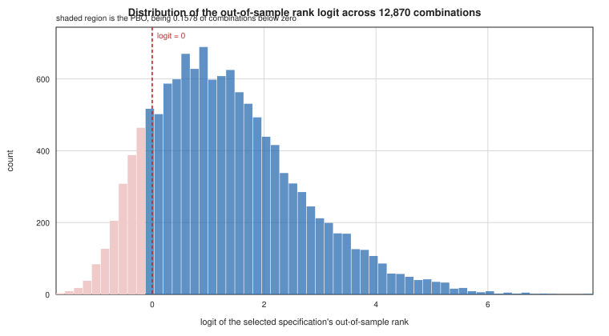
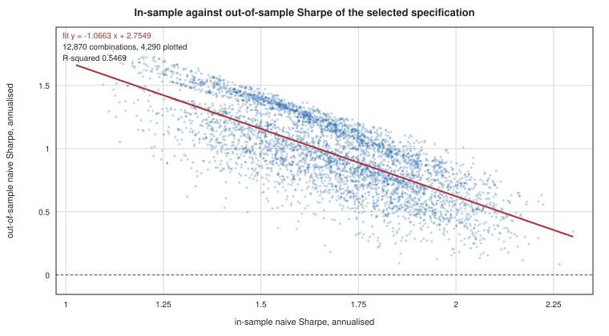
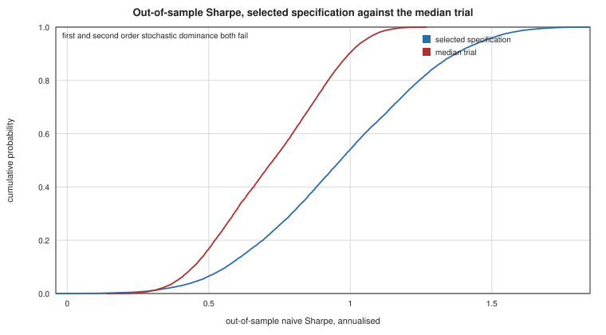
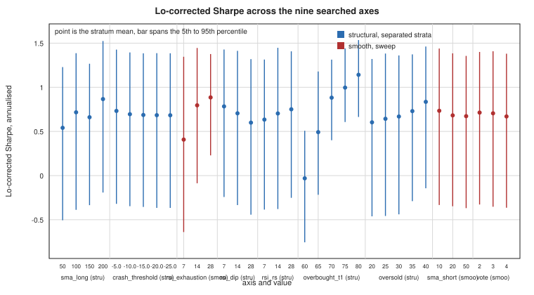

# Session 19 PBO report

Probability of backtest overfitting, the deflated Sharpe, and the specification curve for the completed 121,500 specification grid. Every figure below is read from an emitted CSV in `outputs/session-19/` under 9.12. The holdout boundary 2021-08-01 under 2.10 is untouched and no post-boundary quantity appears here.

This document is regenerable from committed artifacts alone. The panel directory `outputs/session-17/panel/` is never opened by the generator, so this text is identical whether the panel is present or deleted.

## The approximation this rests on

The performance metric throughout the CSCV is the **naive Sharpe** rather than the Lo-corrected Sharpe that 8.2 designates as headline. Autocovariance is not additive across disjoint blocks, so the cross-boundary terms are missing from any union of blocks and a Lo correction computed on a union would be wrong rather than approximate. The naive Sharpe is exactly reconstructible from the stored block sums, which is why it is used. This is a disclosed approximation and it means the PBO here measures overfitting of the naive Sharpe, with the headline Lo-corrected figure reported separately in the specification curve section.

Moment additivity was re-verified this session rather than taken from the recovered session 18 file. The maximum absolute deviation between statistics reconstructed from the 48 stored block moments and the same statistics in the per-specification metric set is 3.331e-16 against a 1e-10 tolerance fixed before the comparison ran, reproducing session 18's 3.3e-16.

## Positive control

The canonical specification is identifier 106312 in shard 7. Its axis values match `src/config.py` with no literal entering the check. It reads annualised return 0.521845 and Lo-corrected Sharpe 1.381701, reproducing the designated cell to six decimals.

## PBO at S equal to 16

**PBO is 0.1578** over 12,870 combinations, being the full enumeration of C(16,8), across 121,500 specifications. That is the frequency with which the specification selected as best in sample lands in the bottom half of the out-of-sample ranking. Session 18's interrupted run measured 0.1578 on the same construction and the figure reproduces.

### Performance degradation

Regressing the selected specification's out-of-sample Sharpe on its in-sample Sharpe gives slope **-1.0663**, intercept 2.7549, and R-squared 0.5469. The slope is reported as measured and without interpretation.

### Probability of loss and stochastic dominance

The probability of loss, being the frequency with which the selected specification returns a negative out-of-sample naive Sharpe, is **0.000078**.

First order stochastic dominance of the selected specification over the median trial does **not** hold, with the CDF condition satisfied on 0.9885 of the support. Second order dominance does **not** hold either, with the integrated CDF condition satisfied on 0.9663 of the support.

### The canonical point, which was not selected

The canonical was pre-registered rather than chosen by the search, so its rank is reported separately from the in-sample-best. Across the 12,870 combinations its out-of-sample rank has median 103,172 of 121,500 and its mean rank expressed as a fraction of the specification count is 0.8243.

### Block-count sensitivity

| S | PBO | combinations | enumeration | degradation slope | R-squared | probability of loss | seconds | peak GB |
|---|---|---|---|---|---|---|---|---|
| 16 (primary) | 0.1578 | 12,870 | full | -1.0663 | 0.5469 | 0.000078 | 775.0 | 2.879 |
| 8 | 0.1143 | 70 | full | -1.1612 | 0.5887 | 0.000000 | 0.4 | 2.879 |
| 12 | 0.1710 | 924 | full | -1.2723 | 0.4254 | 0.000000 | 88.2 | 2.879 |
| 24 | 0.1646 | 20,000 | sampled of 2,704,156 | -1.1477 | 0.4837 | 0.002150 | 598.2 | 3.348 |
| 48 | 0.1540 | 20,000 | sampled of 32,247,603,683,100 | -0.9553 | 0.4947 | 0.001400 | 962.5 | 3.355 |

PBO spans 0.1143 to 0.1710 across the five block counts. At S equal to 24 and S equal to 48 the combination space exceeds the 20,000 cap fixed before the run, so those two passes are random samples at seed 20260821 rather than full enumerations, and that is disclosed per pass in the table.

## PBO within structural strata

The smooth-axis restriction the session 18 prompt specified holds all six structural axes at canonical and varies only the three smooth axes, which spans 27 specifications. A 27-point PBO is not comparable to a 121,500-point figure, so the restriction was replaced rather than run. Holding one structural axis at one value fixes the strategy shape that axis controls and leaves the remaining eight axes free, so the PBO inside a stratum is the parameter-search component alone.

The full-grid reference is 0.1578, being the step 4 primary pass at identical construction.

| structural axis | values | PBO min | PBO max | range | full grid inside |
|---|---|---|---|---|---|
| sma_long | 4 | 0.1033 | 0.1882 | 0.0848 | yes |
| crash_threshold | 5 | 0.1688 | 0.1807 | 0.0120 | no |
| rsi_dip | 3 | 0.0667 | 0.1874 | 0.1207 | yes |
| rsi_rs | 3 | 0.1232 | 0.2303 | 0.1071 | yes |
| overbought_t1 | 5 | 0.0100 | 0.4673 | 0.4573 | yes |
| oversold | 5 | 0.0731 | 0.2026 | 0.1295 | yes |

Per stratum, with the terminals that never fire at that value.

| axis | value | specifications | PBO | dead terminals |
|---|---|---|---|---|
| sma_long | 50 | 30,375 | 0.1033 | 1 |
| sma_long | 100 | 30,375 | 0.1882 | 2 |
| sma_long | 150 | 30,375 | 0.1303 | 2 |
| sma_long | 200 (canonical) | 30,375 | 0.1455 | 2 |
| crash_threshold | -5.0 | 24,300 | 0.1807 | 2 |
| crash_threshold | -10.0 | 24,300 | 0.1733 | 2 |
| crash_threshold | -15.0 (canonical) | 24,300 | 0.1707 | 2 |
| crash_threshold | -20.0 | 24,300 | 0.1688 | 4 |
| crash_threshold | -25.0 | 24,300 | 0.1726 | 4 |
| rsi_dip | 7 | 40,500 | 0.1874 | 1 |
| rsi_dip | 14 (canonical) | 40,500 | 0.1594 | 2 |
| rsi_dip | 28 | 40,500 | 0.0667 | 8 |
| rsi_rs | 7 | 40,500 | 0.1232 | 1 |
| rsi_rs | 14 (canonical) | 40,500 | 0.1720 | 2 |
| rsi_rs | 28 | 40,500 | 0.2303 | 1 |
| overbought_t1 | 60 | 24,300 | 0.0106 | 2 |
| overbought_t1 | 65 | 24,300 | 0.0100 | 2 |
| overbought_t1 | 70 (canonical) | 24,300 | 0.2355 | 2 |
| overbought_t1 | 75 | 24,300 | 0.4673 | 2 |
| overbought_t1 | 80 | 24,300 | 0.3048 | 3 |
| oversold | 20 | 24,300 | 0.0731 | 5 |
| oversold | 25 | 24,300 | 0.0921 | 3 |
| oversold | 30 (canonical) | 24,300 | 0.1392 | 2 |
| oversold | 35 | 24,300 | 0.1853 | 2 |
| oversold | 40 | 24,300 | 0.2026 | 2 |

**Interpretation as measured.** The full-grid PBO exceeds none of the 6 within-stratum ranges, lying inside 5 of them and below 1, which indicates search across strategy shapes does not contribute overfitting beyond parameter search, with the one range it falls below indicating the full grid overfits less than any single stratum of that axis. No recommendation follows from this.

## The deflated Sharpe

N is **364,500**, the size of the search space the study enumerated across ten axes, and the grid evaluated **121,500** of them with the 7.4 tier-two offset held at its canonical value of 10 rather than sampled. Both figures are recorded and the deflated Sharpe is recomputed at 121,500 as the sensitivity.

The probabilistic and deflated Sharpe are computed on the naive Sharpe, since the formula carries its own skewness and excess kurtosis adjustment while the Lo correction addresses autocorrelation, so substituting the Lo-corrected figure would mix two corrections.

**Estimation caveat.** The cross-sectional standard deviation of Sharpe entering the expected maximum is estimated from the 121,500 evaluated specifications, which is a subset of the 364,500 enumerated, so the dispersion of the unevaluated remainder is assumed equal to that of the evaluated subset and is not measured.

| quantity | canonical | in-sample-best |
|---|---|---|
| naive Sharpe, annualised | 1.0911 | 1.4723 |
| skewness | 0.4172 | 0.1109 |
| excess kurtosis | 8.2258 | 6.9907 |
| probabilistic Sharpe against zero | 0.999715 | 0.999998 |
| expected maximum Sharpe, no-skill null, N=364,500 | 2.1082 | 2.1082 |
| **deflated Sharpe at N=364,500** | **0.000660** | **0.023736** |
| deflated Sharpe at N=121,500 | 0.001979 | 0.048847 |

The same figures computed on the Lo-corrected Sharpe are carried in `deflated-sharpe.csv` as a disclosed sensitivity, giving a deflated Sharpe of 0.010884 for the canonical and 0.085737 for the in-sample-best at N equal to 364,500.

The expected maximum Sharpe under the no-skill null, 2.1082 annualised, exceeds both the canonical's 1.0911 and the in-sample-best's 1.4723, which is what produces deflated figures below one half. Reported as measured.

### Cross-sectional Sharpe across the grid

| metric | naive Sharpe | Lo-corrected Sharpe |
|---|---|---|
| mean | 0.6199 | 0.6963 |
| standard deviation | 0.4520 | 0.5441 |
| 5th percentile | -0.2660 | -0.3494 |
| 50th percentile | 0.7442 | 0.8133 |
| 95th percentile | 1.1597 | 1.3967 |

## The specification curve

The canonical point ranks **6,834 of 121,500** on the Lo-corrected Sharpe and **8,237 of 121,500** on annualised return, where rank 1 is the highest.

The six structural axes are shown as separated strata and the three smooth axes as sweeps, per step 5.

### Choice axes under 9.11 plus NAV

| axis | arms sourced | note |
|---|---|---|
| panel | 2 of 2 | sourced from an emitted CSV, compared at cap_arm=cap5 commission_arm=S convention=c2c window=primary |
| convention | 3 of 3 | sourced from an emitted CSV, compared at cap_arm=cap5 commission_arm=S panel=realized window=primary |
| window | 3 of 3 | sourced from an emitted CSV, compared at cap_arm=cap5 commission_arm=S convention=c2c panel=synthetic |
| commission_arm | 4 of 4 | sourced from an emitted CSV, compared at cap_arm=cap5 convention=o2o panel=realized window=primary |
| participation_cap | 2 of 2 | sourced from an emitted CSV, compared at commission_arm=S convention=o2o panel=realized window=primary |
| starting_nav | 5 arms | sourced from an emitted CSV; added to the curve by D20 session 16 |
| slippage_model | 73 arms | sourced from an emitted CSV; the uniform sweep REPLACES the tiered model rather than stacking on it |
| financing_spread | 1 levels | levels sourced; no per-level designated-cell return is carried in an emitted CSV, and D16 is open |
| smh_accrual | 0 arms | NOT SOURCED. 9.8 records the SMH accrual arm as an implementation dimension run at canonical parameters and not crossed into the grid. No emitted CSV in this repository carries a two-arm designated-cell comparison for it |
| sizing_mode | 0 arms | NOT SOURCED. named as a 9.11 curve axis. No emitted CSV in this repository carries a two-arm designated-cell comparison for it |
| completion_rule | 0 arms | NOT SOURCED. the unavailable-fill completion rule, named as a 9.11 curve axis. No emitted CSV in this repository carries a two-arm designated-cell comparison for it |

The tier-two offset under 7.4 is **not** on the curve and was not searched. The register records it as informed rather than closed, so it is not a decision the study made, and a curve spanning it would report sensitivity to a parameter the register never fixed. It is held at its canonical value of 10 on every one of the 121,500 specifications, so the canonical point is unchanged.

### Post-result choices off the recorded axes

| item | status |
|---|---|
| 4.6 starting NAV | closed session 13.7 at 1,000,000; joined the specification curve by D20 session 16, so it is now ON the curve rather than off it. The consequential one, since it enters the return series through integer truncation, the commission minimum, and the participation cap |
| 5.7 per-year covariance | reporting convention, does not enter the return series |
| Sharpe numerator registration | closed as the 8.2 amendment session 13.9, arithmetic mean excess annualised; dual-reported under both numerator definitions |
| D5 disposition | reporting or diagnostic convention, does not enter the return series |
| D6 disposition | reporting or diagnostic convention, does not enter the return series |
| D7 disposition | reporting or diagnostic convention, does not enter the return series |
| D10 disposition | reporting or diagnostic convention, does not enter the return series |

## Custody

The repository gained a remote this session at https://github.com/boomer25tiger/tactical-allocation, private, with the remote main matching local HEAD. 192.18 MB in 862 objects were pushed and the largest tracked file is 282.62 MB of tracked content with nothing over 100 megabytes entering history.

